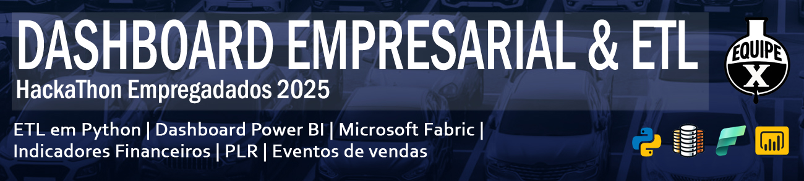

📊 [Clique aqui para visualizar o dashboard no Power BI](https://app.fabric.microsoft.com/view?r=eyJrIjoiMzU1NTYzMjYtODM1OC00YmI5LWJlZmUtNWQ3MzY2NjNhZDY1IiwidCI6IjM0YWIwNGEzLTFlYzAtNGE2Yy1hZjhiLWI2ZjIxYzYwMDk2ZiJ9) - Temporariamente fora do ar

📋 [Clique aqui para acessar a documentação do dashboard](https://github.com/AlvaroBernardino/hackathon2025/blob/main/docs/dashboard.pdf) 

🖥️ [Clique aqui para acessar a apresentação do projeto](https://github.com/AlvaroBernardino/hackathon2025/blob/main/docs/Equipe%20X%20-%20Hackathon%202025%20-%2002_07_2025.pdf)

---

## 📄 Descrição

Este é um sistema **ETL em Python** capaz de extrair dados de duas fontes distintas:  
📊 [Base 1 (Google Sheets)](https://docs.google.com/spreadsheets/d/1cucnW4yVosO5n5BFgwXYv6rVy8yj6NTasM83RTCMOug/edit?gid=373473243#gid=373473243)  
📁 [Base 2 (Excel - SharePoint)](https://empregadados-my.sharepoint.com/personal/bianca_empregadados_com_br/_layouts/15/Doc.aspx?sourcedoc=%7Ba7b62e96-e6e8-4d57-843c-3694c611c6b2%7D)

Após a extração, os dados são tratados, integrados em uma arquitetura **Star Schema** e disponibilizados para um [dashboard em Power BI](https://app.fabric.microsoft.com/view?r=eyJrIjoiNzk1YzdiM2UtMTQ0My00NjFmLWFlNGEtMTMyYzNlMTlhZDc4IiwidCI6IjM0YWIwNGEzLTFlYzAtNGE2Yy1hZjhiLWI2ZjIxYzYwMDk2ZiJ9), que apresenta:

- 📈 Indicadores de metas e performance de vendas/vendedores  
- 💰 Métricas financeiras consolidadas das empresas fictícias **AluCar** e **ConsigCar**

O sistema possui duas versões:
- 🧪 **Protótipo local**: Utiliza SQLite + SQLAlchemy para testes e simulações. Pode ser instalado  e utilizado normalmente on premises.
- ☁️ **Versão final (main)**: Roda na Microsoft Fabric com atualização diária automatizada. Essa é a versão disponibilizada pelos links neste ReadMe.

O projeto foi desenvolvido entre maio e junho de 2025 pelos membros da **Equipe X** (veja seção de autores).

---

## 🎯 Objetivos

Construir um pipeline ETL que:
- 📥 Extraia dados brutos de diferentes fontes (CSV/Excel/Sheets)  
- 🧼 Realize tratamento e padronização dos dados (camada *Silver*)  
- 📊 Disponibilize dados prontos para visualização e análise (camada *Gold*)  
- 📉 Gere dashboards para apoiar decisões estratégicas  
- 🔁 Garanta rastreabilidade, escalabilidade e reprodutibilidade

---

## 🛠️ Tecnologias Utilizadas

- Python (Pandas, SQLAlchemy)
- Microsoft Fabric (Data Factory, Spark, Lakehouse)
- Power BI
- SQLite (versão protótipo)
- GitHub (CI/CD e versionamento)

---

## 🧪 Como Rodar Localmente (Versão Protótipo)

1. Clone o repositório:
```bash
git clone https://github.com/AlvaroBernardino/hackathon2025
cd hackathon2025
```

2. Instale as dependências:
```bash
pip install -r requirements.txt
```

3. Execute os notebooks (em ordem numérica) localizados na pasta `etl`.

4. Verifique os bancos locais com os scripts da pasta `tests`.

---

## 📁 Estrutura de Diretórios

```
hackathon2025/
├── config/         # Arquivos de configuração e credenciais
├── database/       # Estrutura de pastas para banco de dados local
├── docs/           # Documentação do projeto 
├── etl/            # Notebooks e scripts de transformação
├── modelagem/      # Modelos .dbml dos esquemas relacionais
├── retired/        # Scripts legados não utilizados no pipeline final
├── tests/          # Scripts para testes e verificação do banco de dados local
├── changelog.md    # Histórico de versões e alterações
```

## ✍️ Autores

- [Álvaro Bernardino](https://www.linkedin.com/in/alvaro-bernardino/)
- [Caio Prates](https://www.linkedin.com/in/caiolpfreitas/)
- [Laerte Rocha Neves](https://www.linkedin.com/in/laerterochanp/)
- [Luiz Henrique Popoff](https://www.linkedin.com/in/luizpopoff/)

---

> Projeto criado com fins educacionais e para fins de demonstração técnica em processos seletivos e portfólio profissional.
